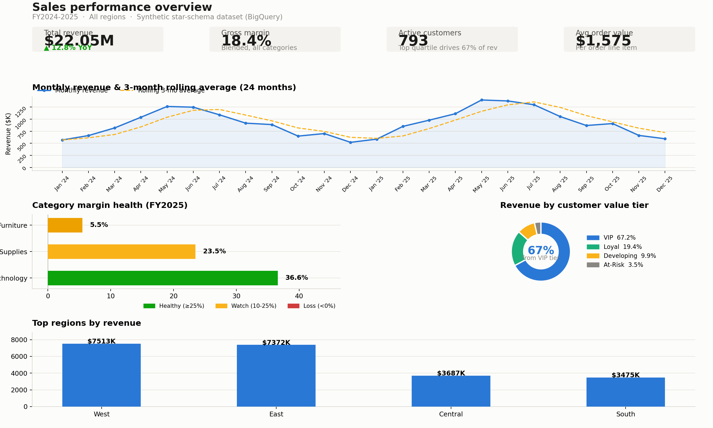
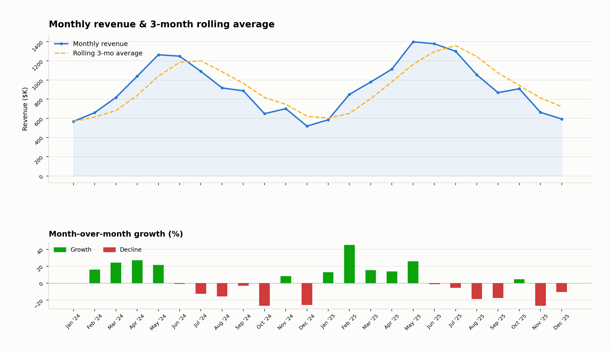
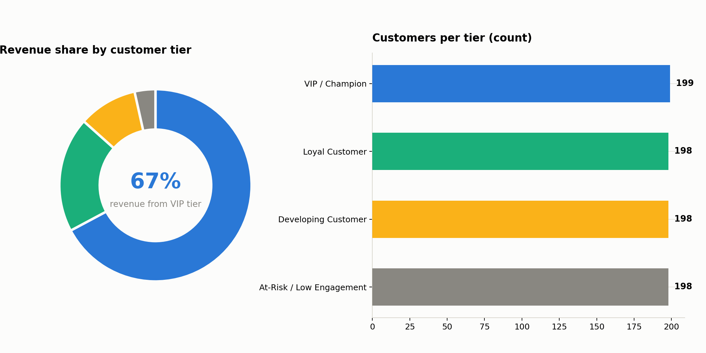
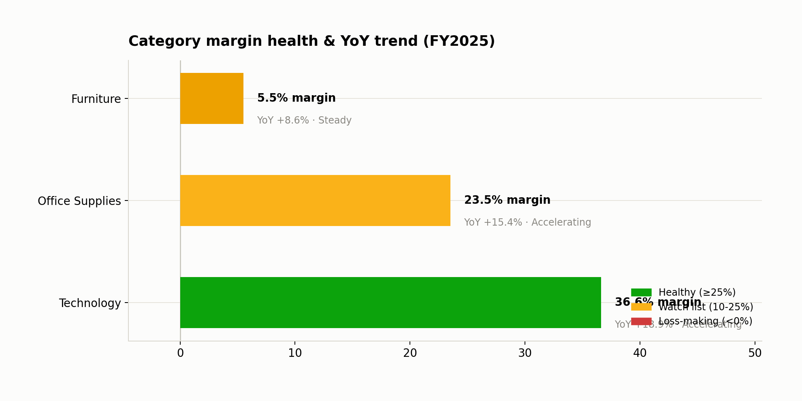
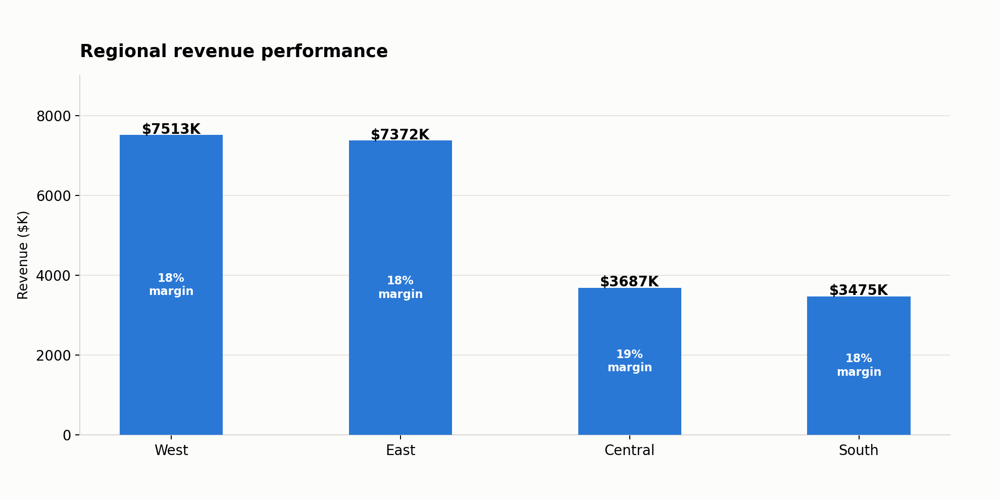
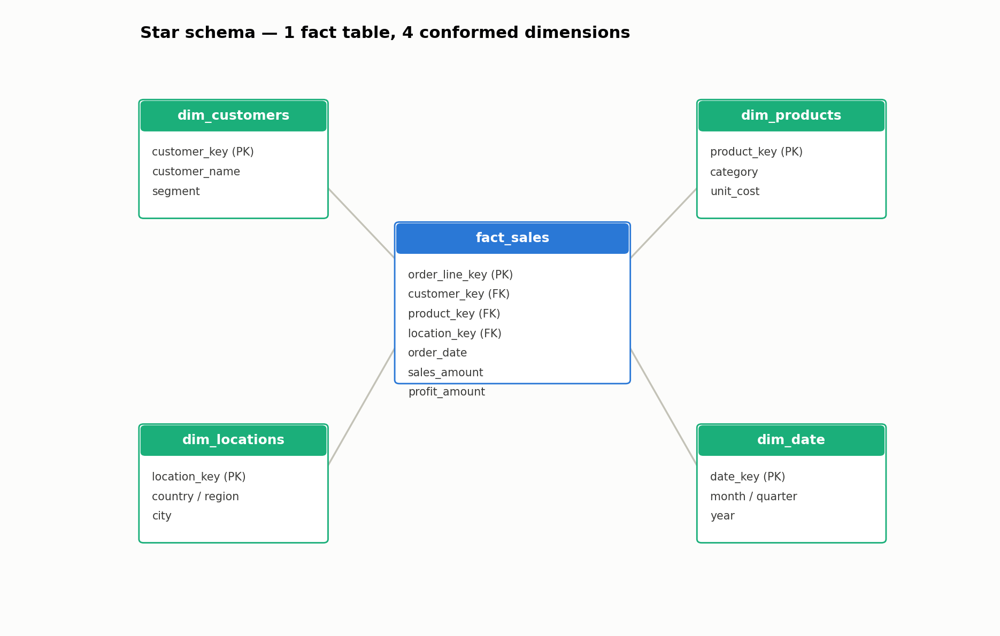

<div align="center">

# 📊 Sales Performance & Executive Dashboard
### A cloud-native BI project simulating an enterprise analytics stack on Google BigQuery

<!-- Tech stack badges -->
[](https://cloud.google.com/bigquery)
[](https://powerbi.microsoft.com/)
[](https://public.tableau.com/)
[]()
[]()

<!-- Repo meta badges -->
[](https://github.com/YOUR_USERNAME/YOUR_REPO/commits/main)
[]()
[](./LICENSE)
[]()

</div>

> **TL;DR:** I modeled a flat retail transaction export into a governed star schema on BigQuery, wrote production-style SQL to validate revenue KPIs, and built an executive dashboard that surfaces where the business is growing, where margin is eroding, and which customers actually drive lifetime value.

<div align="center">

### 🖼️ Dashboard Preview

<!--
Replace the src path below with your actual screenshot once exported from Power BI / Tableau.
Recommended: export at 1600px wide, PNG, and store in /dashboard/screenshots/
-->


*Executive Overview — Revenue trend, MoM growth, margin health at a glance*

</div>

---

## 📑 Table of Contents

- [Business Problem](#-business-problem)
- [Key Findings](#-key-findings)
- [Dashboard Gallery](#-dashboard-gallery)
- [Architecture](#-architecture)
- [Data Model](#-data-model)
- [SQL Analytics Layer](#-sql-analytics-layer)
- [KPI Definitions](#-kpi-definitions)
- [Tech Stack](#-tech-stack)
- [How to Reproduce](#-how-to-reproduce)
- [Repository Structure](#-repository-structure)
- [What I'd Do Next](#-what-id-do-next-with-more-time)

---

## 🎯 Business Problem

Retail leadership has line-item transaction data but no reliable, repeatable way to answer three questions every executive asks monthly:

- **Are we growing month-over-month, and is that growth accelerating or decelerating?**
- **Which product categories are profitable vs. quietly bleeding margin?**
- **Which customers are worth protecting, and which are low-value noise in the CRM?**

This project answers all three with a governed data model instead of one-off spreadsheet pivots.

---

## 📈 Key Findings
*(fill in with your actual numbers once you run the queries — reviewers notice when this table is generic)*

| Metric | Result | So What? |
|---|---|---|
| YoY Revenue Growth | `+__%` | e.g. Growth is decelerating in H2 — flag for leadership |
| Gross Margin (Blended) | `__%` | Technology category subsidizes Furniture's thin margin |
| Top Customer Quartile Contribution | `__%` of revenue from top 25% of customers | Retention > acquisition should be the priority |
| At-Risk Category | `Furniture / Category X` | Margin health flag triggered in the SQL validation layer |

---

## 🖼️ Dashboard Gallery

<!--
Add one row per dashboard page/tab you build. Keep images in /dashboard/screenshots/
and just update the file names below — GitHub renders these automatically.
-->

<table>
  <tr>
    <td align="center" width="50%">
      <br>
      <b>Revenue Trend & MoM Growth</b><br>
      <sub>Rolling 3-month average, growth tiering</sub>
    </td>
    <td align="center" width="50%">
      <br>
      <b>Customer Segmentation</b><br>
      <sub>Quartile-based LTV tiers</sub>
    </td>
  </tr>
  <tr>
    <td align="center" width="50%">
      <br>
      <b>Category Margin Health</b><br>
      <sub>YoY growth + gross margin by category</sub>
    </td>
    <td align="center" width="50%">
      <br>
      <b>Geographic Performance</b><br>
      <sub>Regional revenue breakdown via dim_locations</sub>
    </td>
  </tr>
</table>

<!-- Optional: embed a short demo GIF of the dashboard being interacted with -->
<div align="center">

<br><sub>Interactive demo — filtering by category and date range</sub>
</div>

---

## 🏗️ Architecture

```
Flat CSV (Global Superstore)
        │
        ▼
Google BigQuery Sandbox (free tier, no billing account)
        │  ── star schema: 1 fact + 4 dimension tables
        ▼
SQL Validation Layer (CTEs, window functions, KPI tiering)
        │
        ▼
Power BI Desktop / Tableau Public (executive dashboard)
```

**Why a star schema instead of querying the flat file directly?**
A single denormalized table works for one report. It breaks the moment two dashboards need consistent definitions of "customer" or "category." Modeling `fact_sales` against conformed dimensions (`dim_customers`, `dim_products`, `dim_locations`, `dim_date`) means every downstream tool — Power BI, Tableau, ad hoc SQL — computes the same numbers, which is the entire point of a warehouse.

**Design decisions worth defending in an interview:**
- `NUMERIC` (not `FLOAT64`) on every currency column — avoids float rounding drift in financial rollups.
- `PARTITION BY order_date` + `CLUSTER BY customer_key, product_key` on the fact table — mirrors how a real warehouse controls bytes-scanned cost, which matters even in a free-tier sandbox with query limits.
- A materialized `dim_date` table instead of ad hoc `EXTRACT()` calls — gives every BI tool one shared calendar to build relationships against.

---

## 🧩 Data Model

📄 See [`01_schema_ddl.sql`](./01_schema_ddl.sql)

- **Fact:** `fact_sales` — grain is one row per order line item
- **Dimensions:** `dim_customers`, `dim_products`, `dim_locations`, `dim_date`

<div align="center">

<br><sub>Entity-relationship diagram — export from BigQuery's schema view or draw.io</sub>
</div>

---

## 🔍 SQL Analytics Layer

📄 See [`02_analytics_queries.sql`](./02_analytics_queries.sql)

Three validation scripts run before any dashboard is built:

1. **MoM Revenue Growth & Rolling Average** — `LAG()`/`LEAD()`, 3-month `ROWS BETWEEN` rolling average, `CASE WHEN` growth tiering
2. **Customer Value Segmentation** — `RANK()` and `NTILE()` for quartile-based LTV proxy segmentation
3. **Category YoY Performance** — partitioned `LAG()` for YoY, running `SUM() OVER` for cumulative contribution, margin-health tiering

---

## 💡 KPI Definitions

| KPI | Formula | Notes |
|---|---|---|
| Gross Profit Margin | `(Revenue − COGS) / Revenue` | `profit_amount / sales_amount` at line-item grain, aggregated up |
| YoY Sales Growth | `(Current Year Rev − Prior Year Rev) / Prior Year Rev` | Computed per category via partitioned `LAG()` |
| CAC (approx.) | `Estimated Acquisition Spend / New Customers Acquired` | Approximated since the raw dataset has no marketing spend table — documented as a modeling assumption |
| LTV (approx.) | `Avg Order Value × Purchase Frequency × Customer Lifespan` | Derived from `dim_customers.first_order_date` and fact-table order history |

---

## 🛠️ Tech Stack

<div align="center">


</div>

- **Warehouse:** Google BigQuery Sandbox (free, no credit card)
- **Modeling:** GoogleSQL DDL, Kimball-style star schema
- **Transformation/Validation:** BigQuery SQL (CTEs, window functions)
- **Visualization:** Power BI Desktop (or Tableau Public)
- **Version Control:** Git / GitHub

---

## 🚀 How to Reproduce

1. Create a BigQuery Sandbox project (no billing account required).
2. Run `01_schema_ddl.sql` in the BigQuery Console to create the dataset and tables.
3. Load the source CSV via **Console → Create Table → Upload**, or `bq load`.
4. Run `02_analytics_queries.sql` to validate KPIs before connecting a BI tool.
5. Connect Power BI Desktop via the built-in **Google BigQuery** connector (OAuth, no key file needed) and build the report.

Full step-by-step is in [`SETUP.md`](./SETUP.md).

---

## 📁 Repository Structure

```
├── README.md                     ← you are here
├── 01_schema_ddl.sql              ← star schema DDL
├── 02_analytics_queries.sql       ← KPI validation SQL
├── SETUP.md                       ← BigQuery + Power BI/Tableau connection guide
├── /dashboard
│   ├── executive-dashboard.pbix   ← Power BI file (or .twbx for Tableau)
│   └── /screenshots               ← exported dashboard images used in this README
└── /data                          ← source CSV (or link to source, if licensing requires)
```

---

## 🔭 What I'd Do Next With More Time

- Automate the CSV → BigQuery load with a scheduled Cloud Function instead of manual upload.
- Add a real marketing-spend table to replace the CAC approximation with a defensible figure.
- Build a `dbt` layer on top of the raw tables instead of hand-rolled DDL, for lineage and testing.

---

<div align="center">
<sub>Built by <a href="https://github.com/YOUR_USERNAME">Your Name</a> · <a href="https://www.linkedin.com/in/YOUR_PROFILE">LinkedIn</a> · <a href="mailto:you@email.com">Email</a></sub>
</div>
